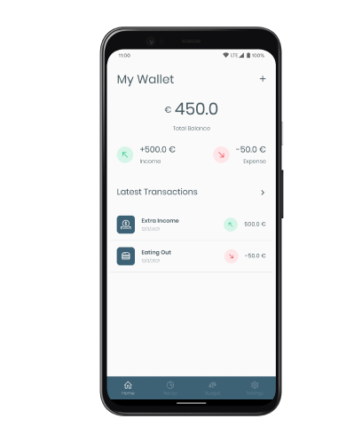
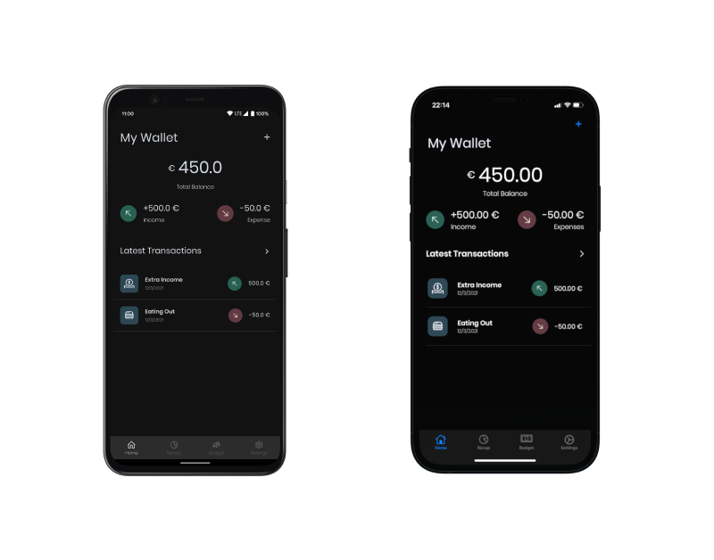

# MoneyFlow
A money management Android and iOS app wrote with Kotlin Multiplatform, Jetpack Compose and Swift UI.

Coming soon: Desktop App (with Compose for Desktop) and MacOS App (with SwiftUI).

<div align="center">
  
</div>

MoneyFlow comes also in dark 🌃:

<div align="center">
  
</div>

## Features roadmap 

🚧 This project is a work in progress, some features are missing and they will arrive in the future.

- ✅ Transaction Entry
- 🏗 Transaction List 
- 💭 Recap screen with plots 
- 💭 Budgeting feature  
- ✅ Database import and export
- 🏗 Sync data with Dropbox

Legend:
- ✅ Implemented
- 💭 Not yet implemented, still in my mind!
- 🏗 Working on it

## Further Readings

I wrote an article about all the decisions and the thoughts that I’ve made to come up with an architecture for MoneyFlow.

[Choosing the right architecture for a [new] Kotlin Multiplatform, Jetpack Compose and SwiftUI app](https://www.marcogomiero.com/posts/2020/kmm-shared-app-architecture/)

## License 📄

```
   Copyright 2020-2021 Marco Gomiero

   Licensed under the Apache License, Version 2.0 (the "License");
   you may not use this file except in compliance with the License.
   You may obtain a copy of the License at

       http://www.apache.org/licenses/LICENSE-2.0

   Unless required by applicable law or agreed to in writing, software
   distributed under the License is distributed on an "AS IS" BASIS,
   WITHOUT WARRANTIES OR CONDITIONS OF ANY KIND, either express or implied.
   See the License for the specific language governing permissions and
   limitations under the License.
```